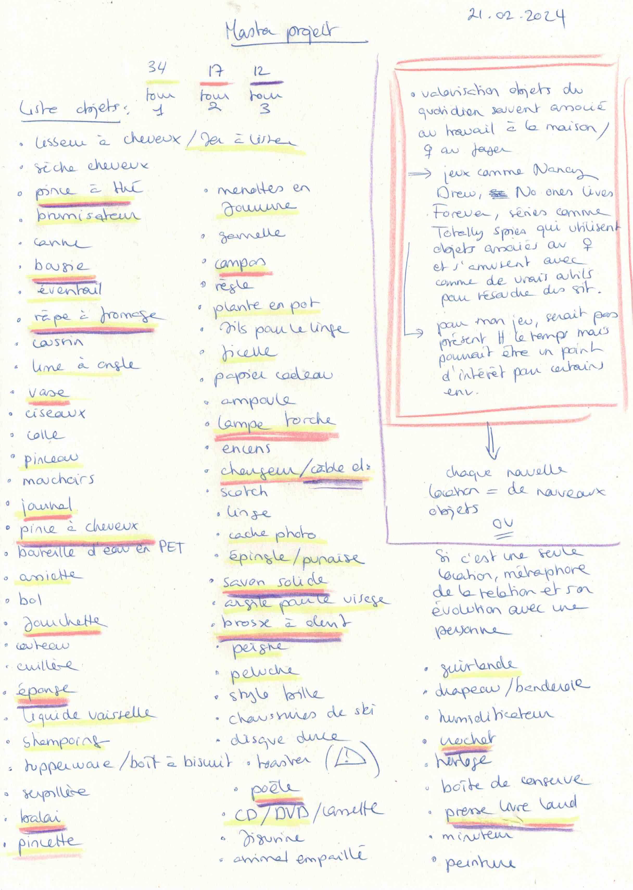
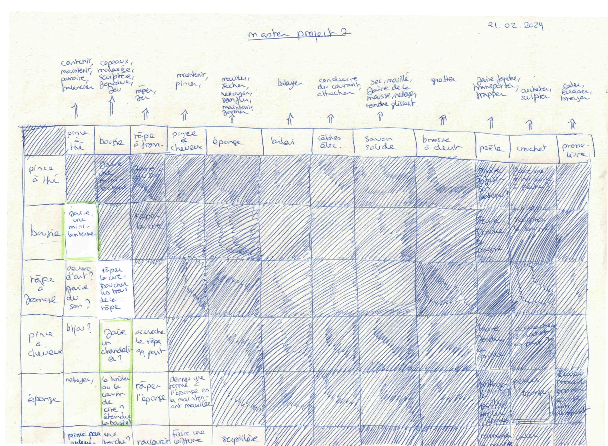
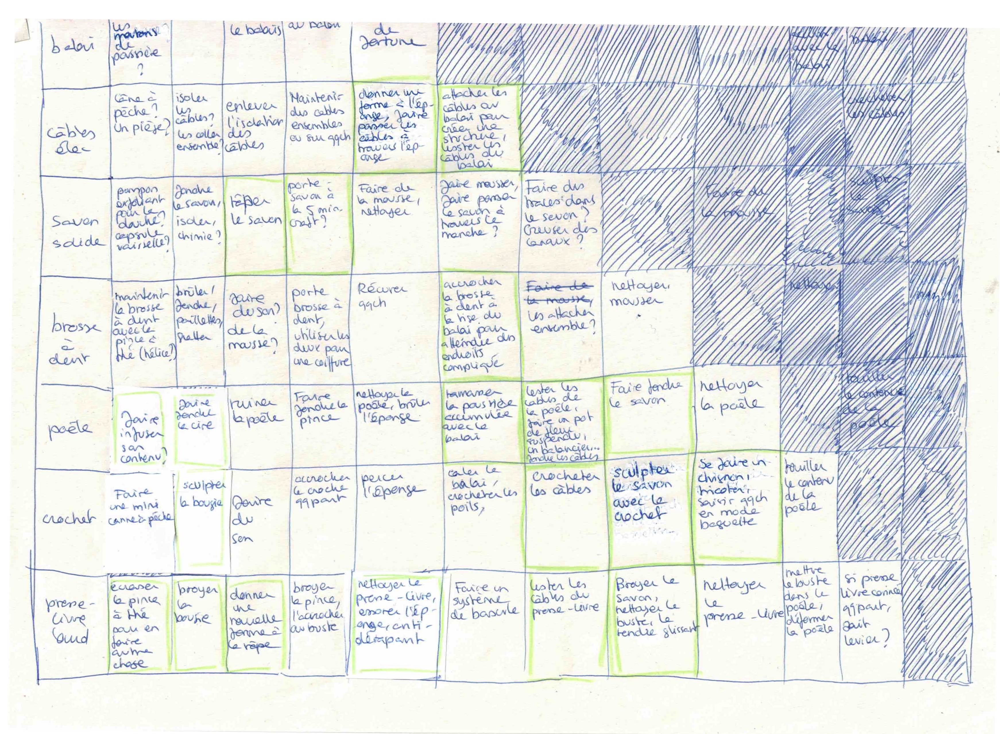

# Everything I have for now

## 21.02.2024

During these three days, I wrote a small project presentation to summarize what is clear and what still need to be decided.

I also listed different objects we can find in a "basic" appartment. In this list, I selected 12 of them and drew a board to list the different interactions possible between each of them.
After that, I circled in green the ones I thought were the most interesting. This is a first draft and depending on the final appartment's owner, I may need to redo it with other objects.

I also started playing Unpacking and really loved it. The visual storytelling is really good, I definitely need to take inspiration from it. I'm amazed how the game makes you learn about your character and how you feel like progressively owning the place by unpacking your stuff and chosing where to place it. The way the game is slowly adding more complexity whitout giving you written instructions is really good too.

