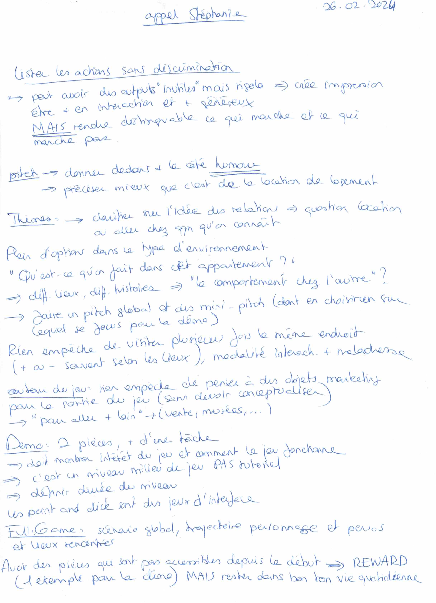
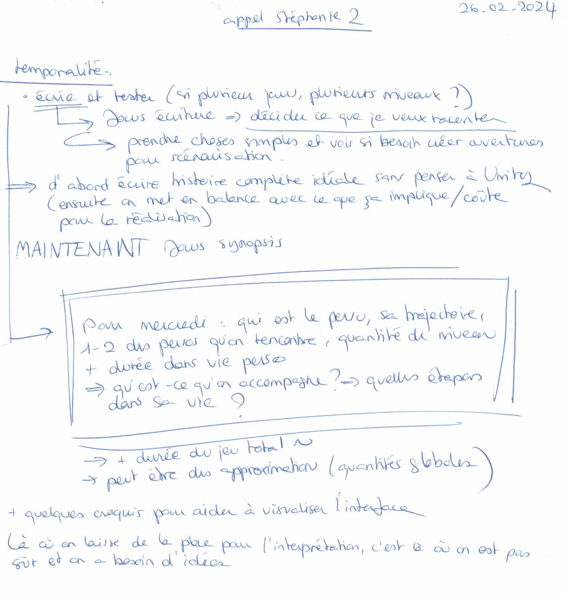
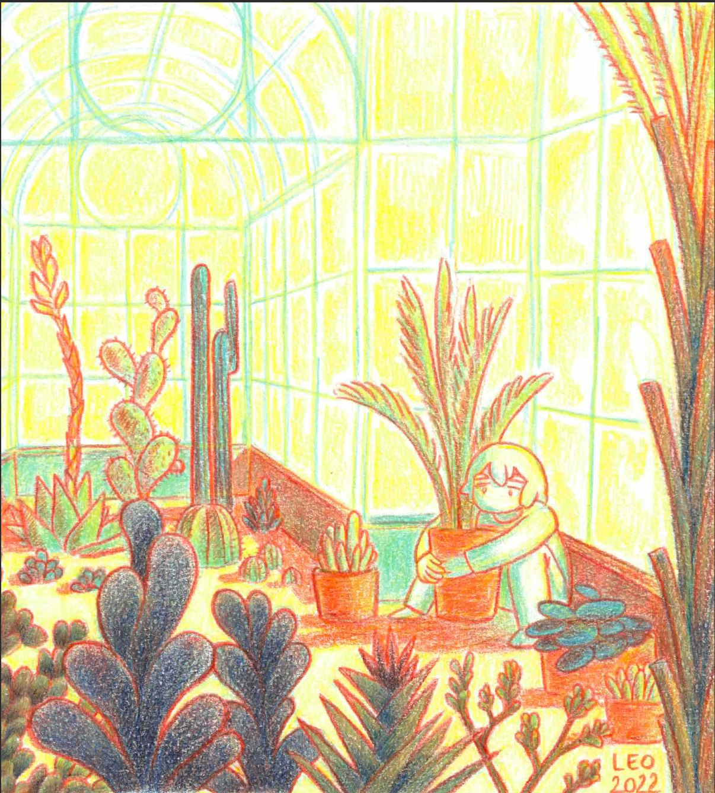
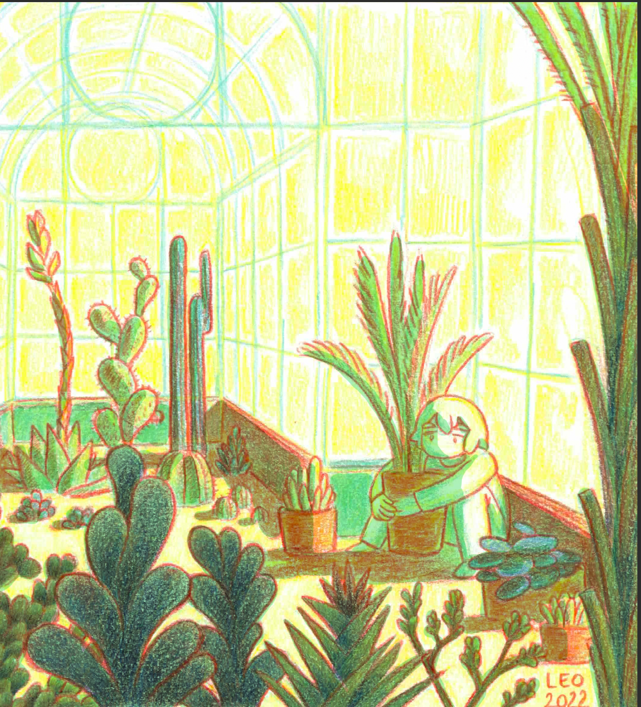
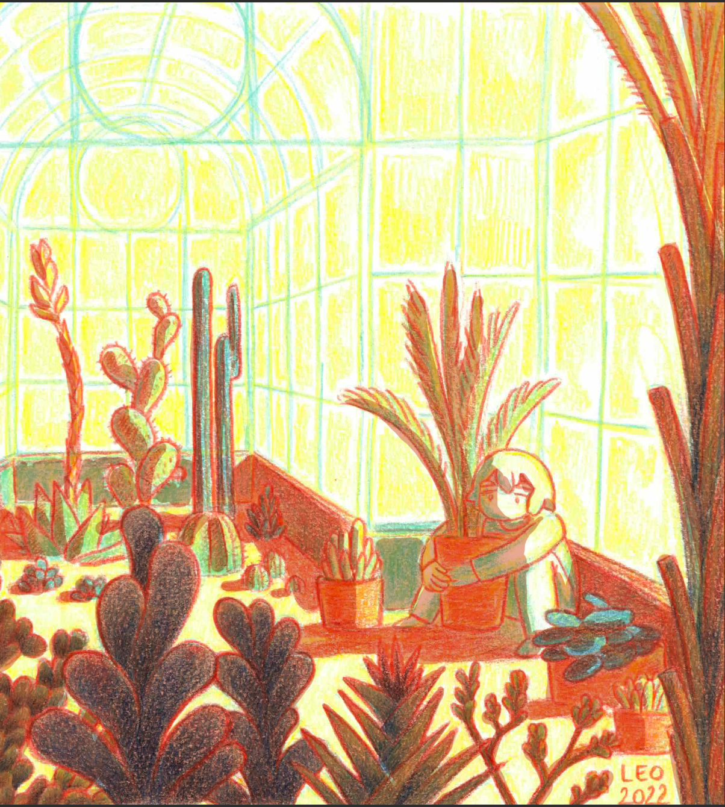
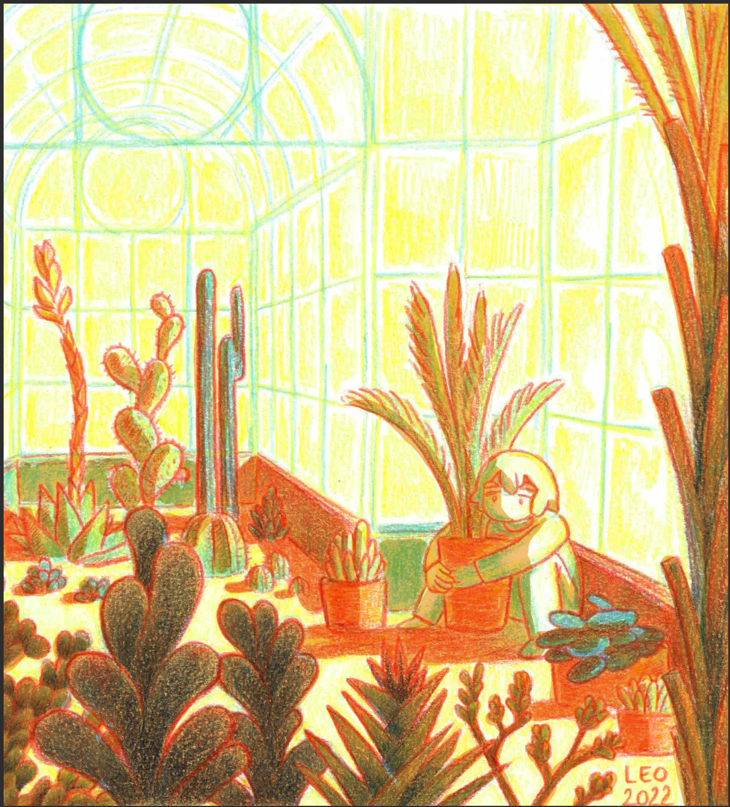
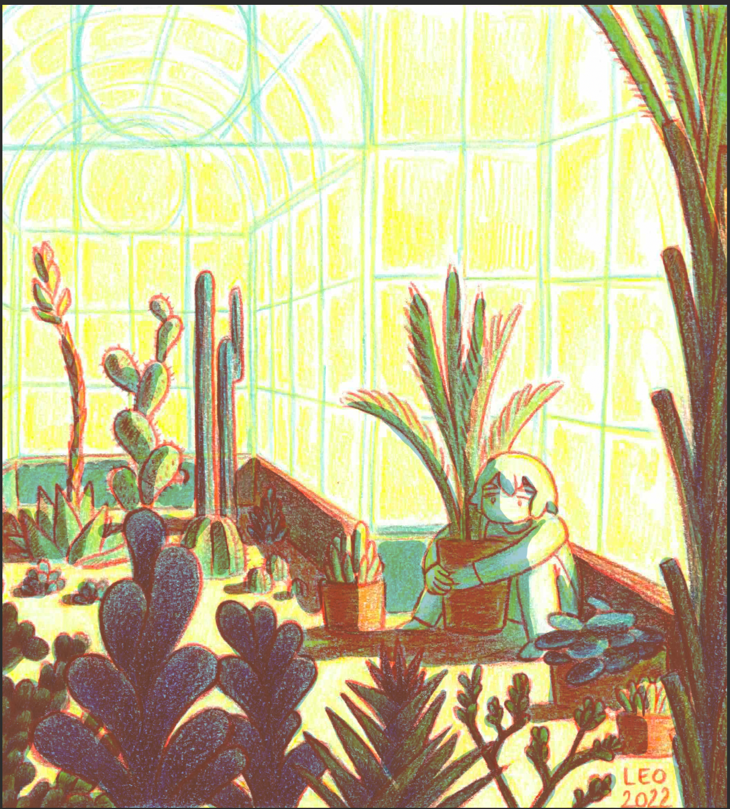
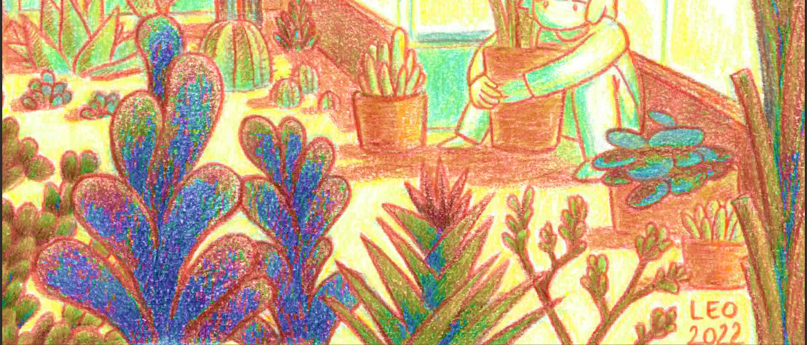

# Second call with my tutor and color tests

## 26.02.2024

I made a second call with my tutor. We decided that I should focus more on writing the story in addition of other things (I took notes of what we talked about).

The same day, I made some tests with an old color pencil drawing to see what the aesthetic of my game could be. I would love to mix analog and digital technics if possible. Or at least to have a strong visual identity.

