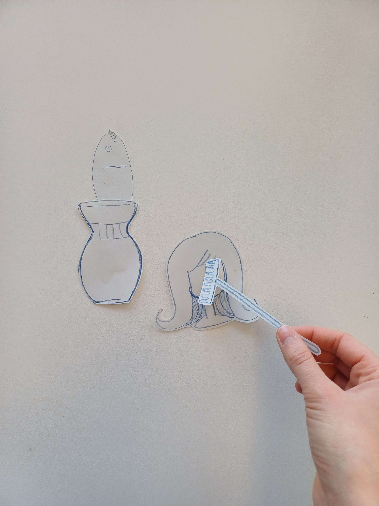
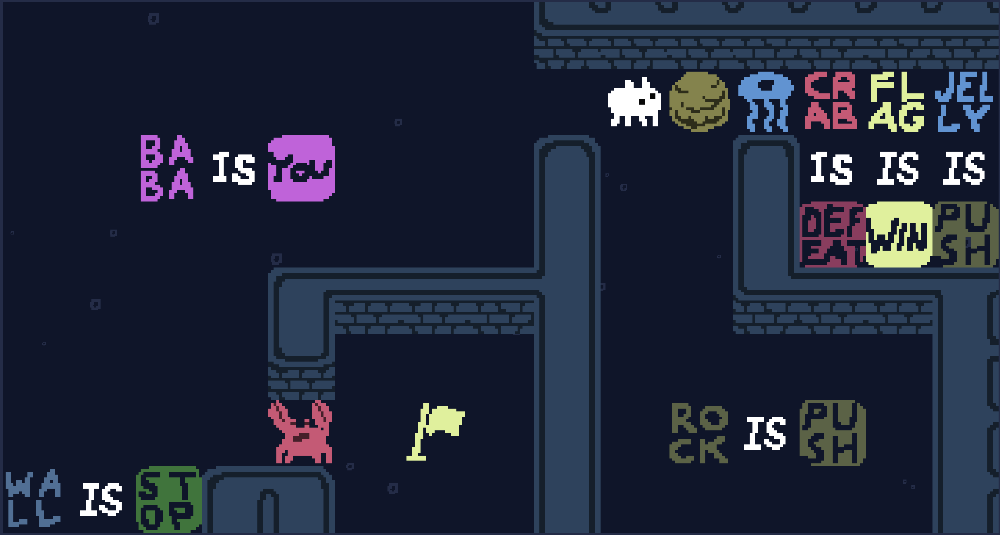
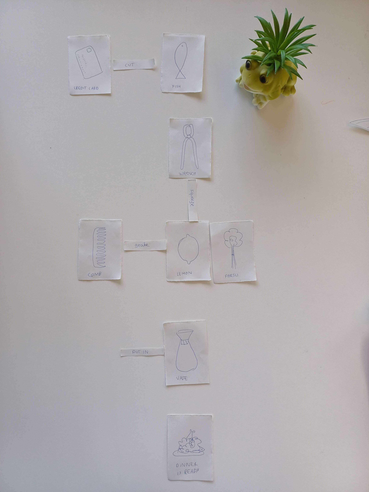
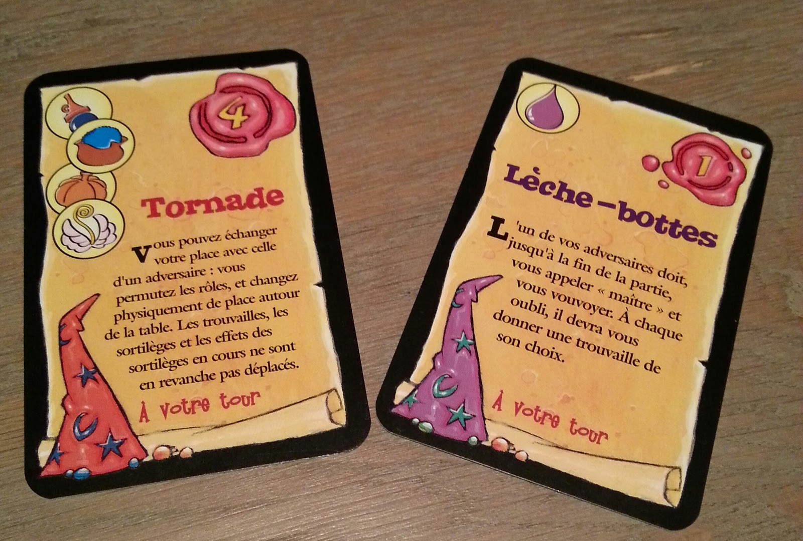
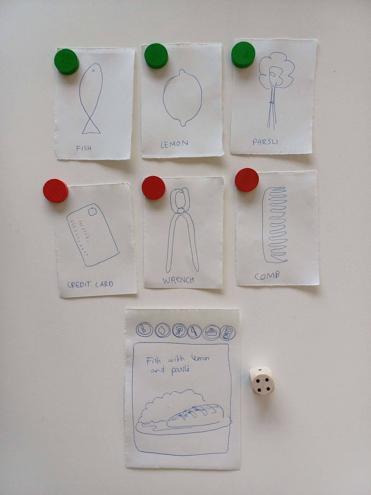

# Mini-brief

## 06.12.2023

1. Question: How people deal with the unexpected and how can this be used in video games ?
2. Method: Create a game in which you have to do domestics tasks but with unusual tools.
3. Test day: Use paper prototypes to see how creative people can be in the way they achieve a goal with given tools.
4. Material: Paper, scissors, pens and glue to build the prototypes.
5. Next steps: Try to do different prototypes to see which one work the best to explore my question.

## What I have done so far

The first prototype was just made to play with paper shapes, to combine them and see if it could bring ideas or funny outputs.

The second one was inspired by the game "Baba is you". Objects are drawn on cards and you can create relation between them by connecting them with "action" cards. It can make funny interactions and is pretty versatile but it is hard to find an output once the structured is finished.

Image source: Screenshot

The third one is inspired by RPGs and the card game "Elixir". You have different "Task" cards to fullfill. Each "Task" card has a list of different objects you need to collect in order to fullfill the task but you may not have all of them right away. You have to fullfill your "Tasks" before your oponents. To fullfill a "Task", choose 6 "Object" cards. Correct objects = 1 point, Incorrect object = 0. Count the points you have between these 6 cards. Then, roll a dice. If the value is less or equal to your score, your task is fullfilled. Otherwise, you will have to try again later in the game.

Image source: http://ludorinthe.blogspot.com/2013/04/elixir.html

