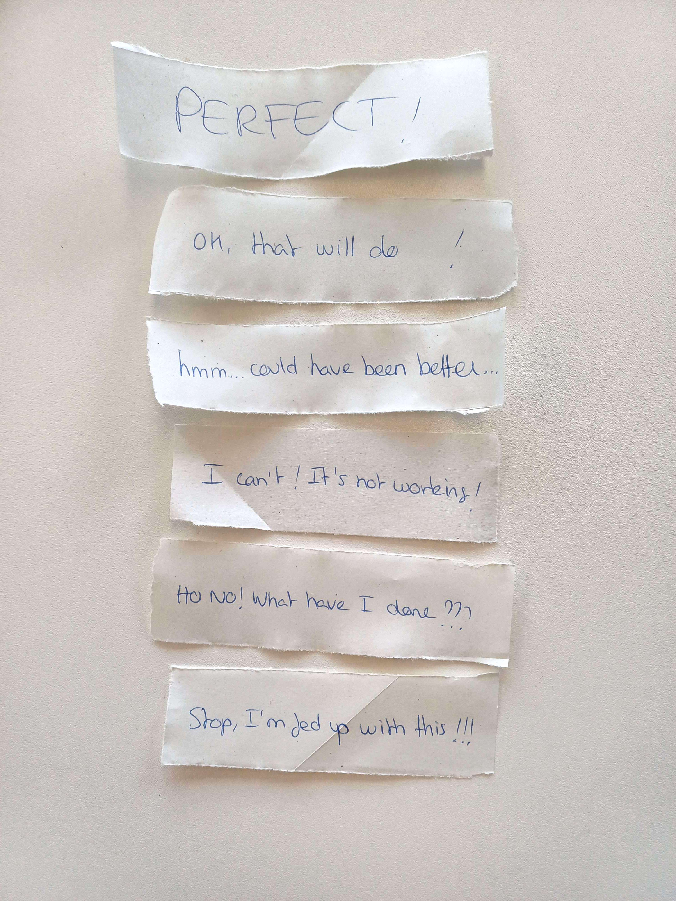

# First test of my paper prototype

## 12. 12. 2023

I started the day by doing "action" cards before realising that it might be not necessary for my prototype. There are so much actions possible I felt I couldn't list them all. I was worried it might slow the reflexions et answers from the players too. So I decided to test my prototype without them and it turned out well.

I talked with Camille and she said I should try to add more context and challenge to the chores. That's what I did for three of them. For example, I wrote for the "Cleaning the floor" chore: Lot of dust, mud marks (shoes, because you went hicking), floor made of stone, therefore, very slippery when wet, the cat threw up in a corner.

Before testing my prototype with a friend, I wrote different "output sentences". This way, I could test them and see what works best.

The testing phase went really well. I explained to my friend that they just moved out in a new appartement with their partner and children. While everyone is at work/school, they have to do housechores. But they have only certains objects they can use since the majority of it is still packed in cardboard boxes.

I asked them to do three chores: clean the floor, cook, iron the laundry. For each task, I specified the context and challenges. After the test, we made a debrief and I took some notes about what worked well and what would need to be improved.

