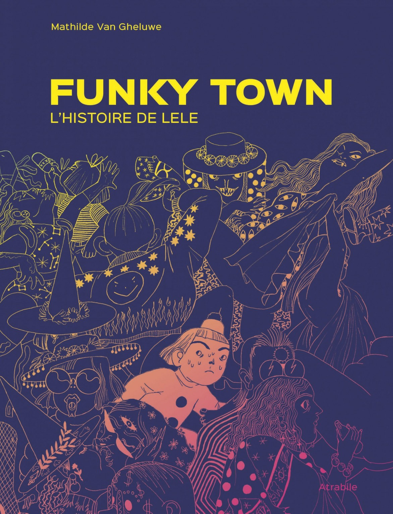
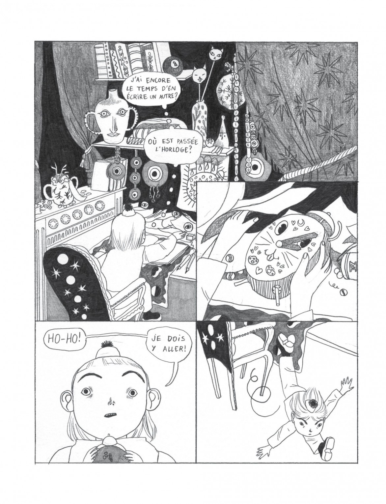
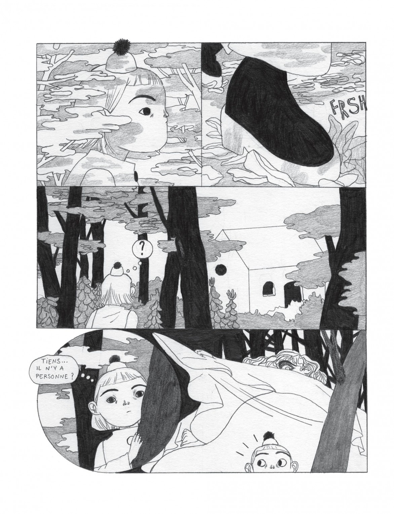
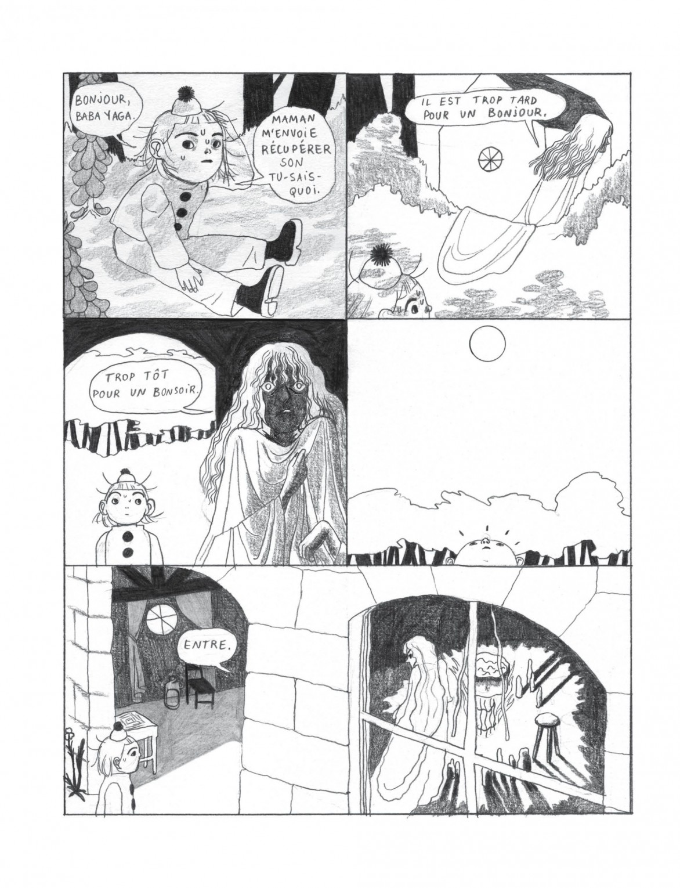
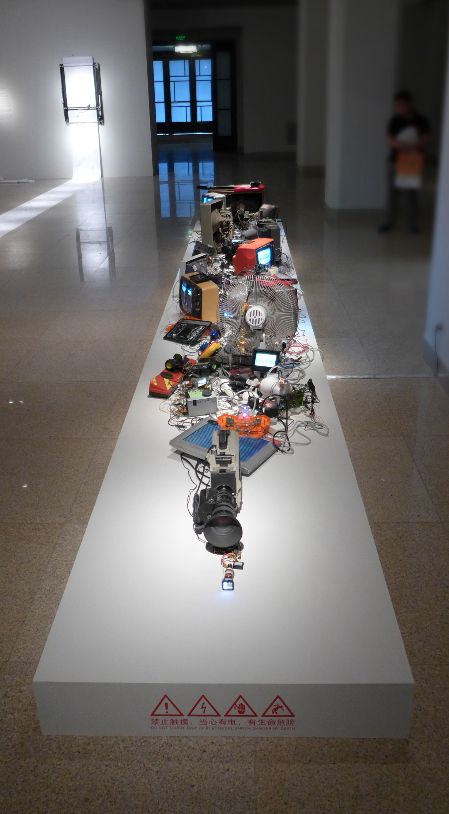
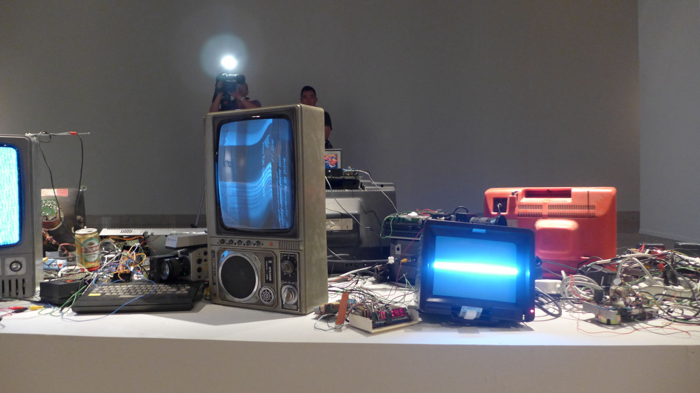
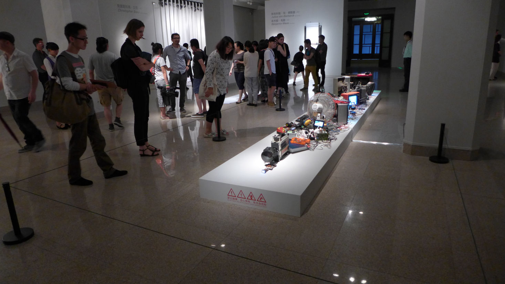

# Like/Don't like

## 23.10.2023

From an exercise we had to do. We had to show 3 things we like and one thing we don't.

# Like

## Funkytown by Mathilde Van Gheluwe

A comic following the point of view of a little girl living in a strange city. I really like the artstyle and the way the story is told. We have to use our imagination to understand what's happening, everything is pretty mysterious.

## Birth by Madison Karrh

A video game in which you have to solve puzzle in a city in order to find body pieces and, therefore, build yourself a friend. I like the fact we have little to zero instructions to what we have to do. We have to explore and figure out by ourselves how things work.

## Papier Machine n°0 by Pinaffo and Pluvinage

A tool kit to create small machines made of paper and conductive ink. It's really colorful and playful. I like the idea of playing with paper that we tend to see as fragile and make electronic objects out of it. It's a good way to be introduced to electronic.

# Don't like

## Refunct Media 7 by Benjamin Gaulon

It's not that I don't like the project. I think it's actually pretty cool. I just don't see myself doing it. I'm not that interested in spending hours connecting objects between them trying to make something happens.

